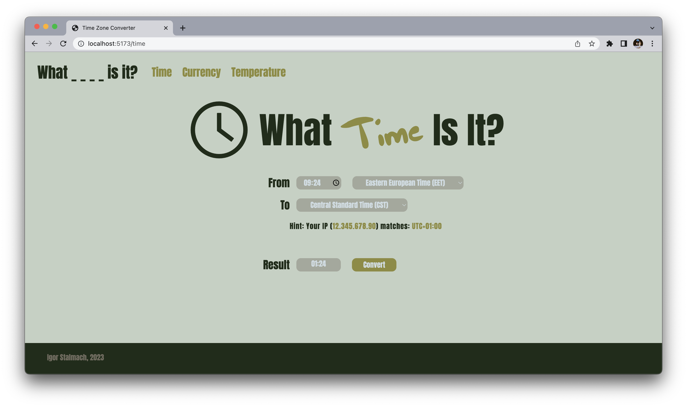

# What _ _ _ _ is it?
## A React website for converting various data inputs.

### Time converter

- Support for a variety of time zones, including UTC, GMT and different local abbreviations.
- Not sure what time zone you are in? No worries! Website automatically detects your public IP address and suggests a time zone based on that.
- Pick a time in a handy hour picker, select chosen time zones and click convert!
- Chrome browser recommended for best visuals.

### Work in progress
- More converters coming soon!