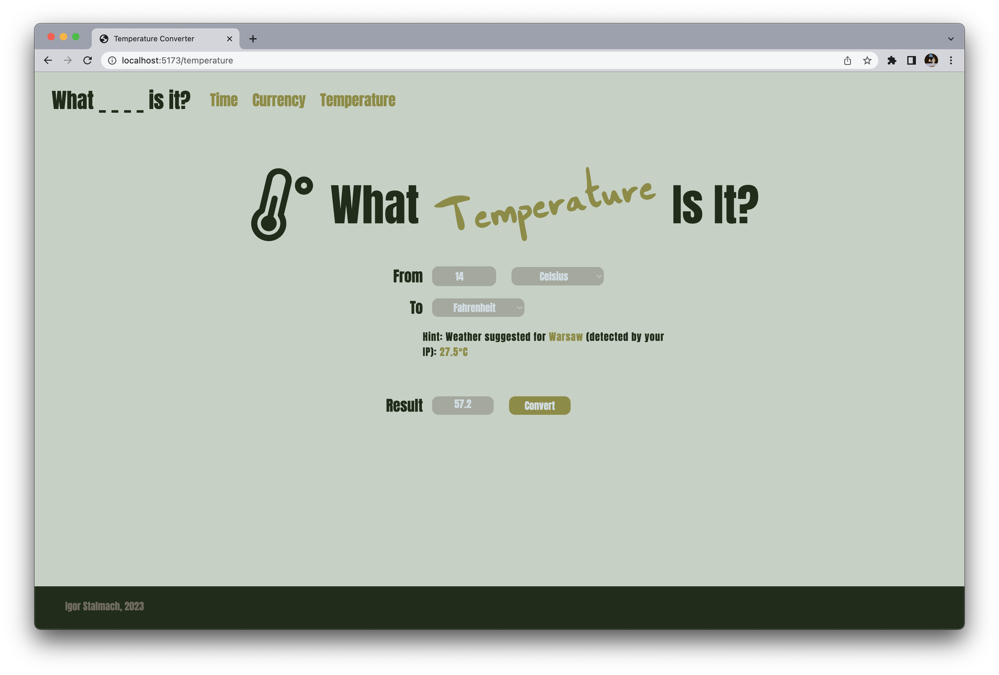

# What _ _ _ _ is it?

## A React website for converting various data inputs.

### Time zone converter

- Support for a variety of time zones, including UTC, GMT and different local abbreviations.
- Not sure what time zone you are in? No worries! Website automatically detects your public IP address and suggests a time zone based on that.
- Pick a time in a handy hour picker, select chosen time zones and click convert!
- Utilizes an [IP Geolocation API](https://ip-api.com) and [Geolocation Database API](https://geolocation-db.com).
- Chrome browser recommended for best visuals.

### Currency Converter

- Support for 160+ different currencies from all over the world.
- Utilizes an [Exchange Rate API](https://www.exchangerate-api.com).
- Chrome browser recommended for best visuals.

### Temperature Converter

- Support for Celsius (°C), Fahrenheit (°F) and Kelvin (K) scales.
- Don't feel like looking out the window? Website provides a local temperature of the city you are in (based on public IP, results may vary).
- Utilizes a [Weather API](https://open-meteo.com), [IP Geolocation API](https://ip-api.com) and [Geolocation Database API](https://geolocation-db.com).
- Chrome browser recommended for best visuals.